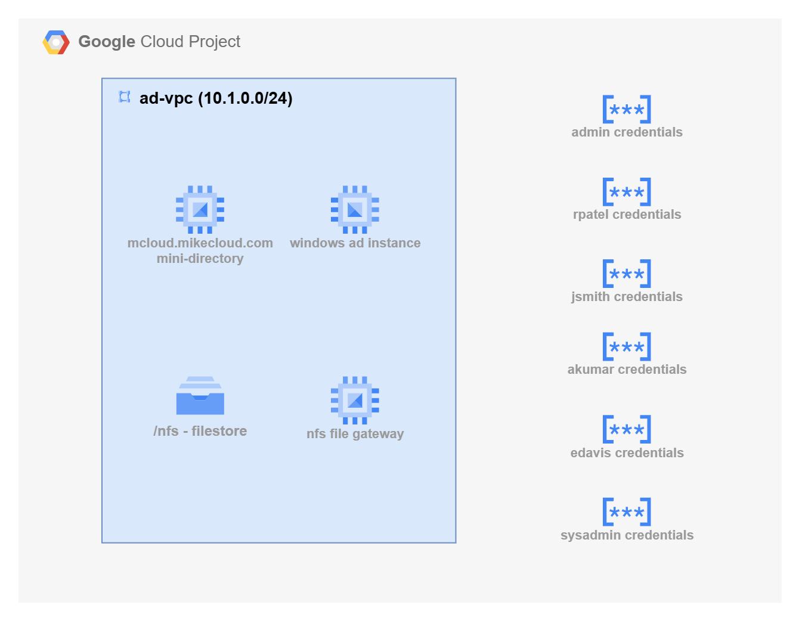

# GCP Mini Active Directory with Filestore: SMB & NFS File Sharing

This project extends the original **GCP Mini Active Directory** lab by integrating **Filestore** as a managed shared storage backend. Instead of relying only on local disks or standalone file servers, this solution demonstrates how to expose Filestore storage in two ways:  

1. **Direct NFS Mounts on Linux Clients** – Linux machines joined to the mini-AD domain mount Filestore via the NFS 3.0 or 4.1 protocol for scalable, POSIX-compliant storage.  
2. **SMB Access via NFS Gateway** – Windows machines joined to the mini-AD domain connect to a Samba-based NFS gateway, which translates NFS exports from Filestore into SMB shares, enabling Active Directory authentication and group-based access.  

The mini-AD environment (Samba 4 on Ubuntu) provides Active Directory authentication and DNS services. Filestore provides fully managed NFS storage tiers with flexible performance and capacity options. Together, they enable a hybrid setup where both Linux and Windows domain-joined clients can consume GCP-native storage seamlessly.  



## ☁️ Filestore Service Tiers Overview

**Filestore** is Google Cloud’s managed **NFS** (Network Attached Storage): a shared file system exposed over NFS to your VMs and GKE clusters without you needing to run a fileserver yourself. You are billed for **provisioned capacity** (not used bytes), can scale capacity, and choose tiers based on your needs for cost, performance, and availability.

---

### ⚙️ Capacity Ranges (Min → Max)

| Tier | Minimum Size | Maximum Size | Scaling Increments | Location Type |
| :--- | :--- | :--- | :--- | :--- |
| **Basic HDD** | **1 TiB** | **63.9 TiB** | 1 GiB (Up only) | Zonal |
| **Basic SSD** | **2.5 TiB** | **63.9 TiB** | 1 GiB (Up only) | Zonal |
| **Zonal** | **1 TiB** | **100 TiB** | 256 GiB or 2.5 TiB | Zonal |
| **Regional** | **1 TiB** | **100 TiB** | 256 GiB or 2.5 TiB | Regional |
| **Enterprise** | **1 TiB** | **10 TiB** (per instance) | 256 GiB (Up or down) | Regional |
| *Enterprise Multishare* | 1 TiB | Up to 80 shares (up to **320 TiB** total capacity) | 256 GiB | Regional |

---

### 🔒 NFS Protocol Support

| Tier | NFSv3 | NFSv4.1 | Key Differentiator |
| :--- | :--- | :--- | :--- |
| **Basic HDD/SSD** | ✅ Yes | ❌ No | Simplicity, compatibility (NFSv3 only) |
| **Zonal** | ✅ Yes | ✅ Yes | Highest Zonal performance and NFSv4.1 features. |
| **Regional** | ✅ Yes | ✅ Yes | Regional redundancy (high availability) with NFSv4.1 features. |
| **Enterprise** | ✅ Yes | ✅ Yes | Highest availability (**multi-zone redundancy**) for mission-critical apps and NFSv4.1 features. |

---

### 💰 Minimal Deploy Size: Cost Comparison (Illustrative)

> These are illustrative monthly costs based on the minimum instance size and *approximate* public pricing for a typical US region (e.g., `us-central1`). **Actual costs vary by region.**

| Tier | Availability | **Minimum capacity** | **Approx $/GiB-month** | **Est. monthly @ min size** |
| :--- | :--- | :---: | :---: | :---: |
| **Basic HDD** | Zonal | **1 TiB** | ~**$0.20** | ~**$204.80** |
| **Basic SSD** | Zonal | **2.5 TiB** | ~$0.30 | ~$768.00 |
| **Zonal** (Default perf) | Zonal | **1 TiB** | ~**$0.28** | ~**$286.72** |
| **Regional** (Default perf) | Regional | **1 TiB** | ~$0.45 | ~$460.80 |
| **Enterprise** | Regional | **1 TiB** | ~$0.45 | ~$460.80 |

#### Key Cost Notes:

* **Custom Performance (Zonal/Regional):** Selecting **Custom Performance** lowers the $/GiB-month charge but introduces two new hourly fees: a **per-instance hourly charge** and a **per-IOPS hourly charge**. The total cost will depend on the custom IOPS you provision.
* **Basic Tiers:** The Basic tiers (HDD/SSD) often have a **per-GiB rate AND an hourly instance fee**, which is factored into the approximate blended $/GiB-month rate shown above.
* **NFSv4.1:** To utilize features like **Kerberos/Active Directory integration** and stronger security, you must select **Zonal, Regional, or Enterprise**. Basic tiers are **NFSv3-only**.

## Prerequisites

* [A Google Cloud Account](https://console.cloud.google.com/)
* [Install gcloud CLI](https://cloud.google.com/sdk/docs/install) 
* [Install Latest Terraform](https://developer.hashicorp.com/terraform/install)

If this is your first time watching our content, we recommend starting with this video: [GCP + Terraform: Easy Setup](https://youtu.be/3spJpYX4f7I). It provides a step-by-step guide to properly configure Terraform, Packer, and the gcloud CLI.

## Download this Repository  

Clone the repository from GitHub and move into the project directory:  

```bash
git clone https://github.com/mamonaco1973/gcp-filestore.git
cd gcp-filestore
```  

---

## Build the Code  

Run [check_env](check_env.sh) to validate your environment, then run [apply](apply.sh) to provision the infrastructure.  

```bash
develop-vm:~/gcp-file-store$ ./apply.sh
NOTE: Validating that required commands are in PATH.
NOTE: gcloud is found in the current PATH.
NOTE: terraform is found in the current PATH.
NOTE: All required commands are available.
NOTE: Checking Google Cloud CLI connection.
NOTE: Successfully authenticated with GCP.
Initializing provider plugins...
Terraform has been successfully initialized!
```  
## Build Results

When the deployment completes, the following resources are created:

- **Networking**
  - A **custom-mode VPC** with dedicated subnets for the domain controller, the NFS gateway, and client VMs
  - **Firewall rules** for required AD/DC ports (e.g., 53 DNS, 88 Kerberos, 123 NTP, 135/445 RPC/SMB, dynamic RPC range) and **NFS (2049)** from trusted subnets to Filestore / gateway
  - Internal DNS resolution provided by the Samba DC (with forwarders as configured)

- **Security & Identity**
  - **Secret Manager** entries for administrator and user credentials
  - **Service accounts** and IAM bindings (least-privilege) for Compute Engine and Filestore access
  - Required **Google APIs enabled** (Compute, Filestore, Secret Manager, etc.)

- **Active Directory Server**
  - An **Ubuntu** Compute Engine VM running **Samba 4** as Domain Controller and DNS
  - Configured **Kerberos realm** and **NetBIOS** name
  - Administrator credentials stored in **Secret Manager**
  - **User/group bootstrap** via Terraform template: `01-directory/scripts/users.json.template`

- **Shared Storage (Filestore)**
  - A **Filestore instance** with an exported share (e.g., `filestore`)
  - Mount target reachable from the NFS gateway and (optionally) Linux clients
  - Mounted on the gateway (e.g., `/nfs`) with POSIX ownership/permissions applied by init scripts

- **Client & Gateway Instances**
  - **NFS Gateway (Linux):** Ubuntu VM **joined to the domain**, mounts Filestore, and **re-exports as SMB** via Samba for Windows clients  
    - Bootstrapped by: `02-servers/scripts/nfs_gateway_init.sh`
  - **Windows Client:** Windows Server VM **auto-joined to the domain** at first boot  
    - Bootstrapped by: `02-servers/scripts/ad_join.ps1`
  - Both paths authenticate against the **mini-AD** domain (Linux via NSS/SSSD + Kerberos, Windows via native AD)


## Users and Groups

As part of this project a set of **users** and **groups** are automatically created through a scripted process. These resources are intended for **testing and demonstration purposes**, showcasing how to automate user and group provisioning in a mini Active Directory environment.

### Groups Created

| Group Name    | Group Category | Group Scope | gidNumber |
|----------------|----------------|----------------|------------|
| mcloud-users   | Security       | Universal     | 10001 |
| india          | Security       | Universal     | 10002 |
| us             | Security       | Universal     | 10003 |
| linux-admins   | Security       | Universal     | 10004 |

### Users Created and Group Memberships

| Username | Full Name   | uidNumber | gidNumber | Groups Joined                    |
|---------|------------|-----------|-----------|----------------------|
| jsmith  | John Smith  | 10001 | 10001 | mcloud-users, us, linux-admins |
| edavis  | Emily Davis | 10002 | 10001 | mcloud-users, us |
| rpatel  | Raj Patel   | 10003 | 10001 | mcloud-users, india, linux-admins |
| akumar  | Amit Kumar  | 10004 | 10001 | mcloud-users, india |

---


### Understanding `uidNumber` and `gidNumber` for Linux Integration

The **`uidNumber`** (User ID) and **`gidNumber`** (Group ID) attributes are critical when integrating **Active Directory** with **Linux systems**, particularly in environments where **SSSD** ([System Security Services Daemon](https://sssd.io/)) or similar services are used for identity management. These attributes allow Linux hosts to recognize and map Active Directory users and groups into the **POSIX** (Portable Operating System Interface) user and group model.


### Log into Windows Instance  

After the Windows instance boots, the [startup script](02-servers/scripts/ad_join.ps1) executes which does the following tasks   

- Install Active Directory Administrative Tools   
- Join EC2 Instance to Active Directory  
- Grant RDP Access  
- Final System Reboot  

Administrator credentials are stored in the `admin_ad_credentials` secret.


### Log into Linux Instance  

When the Linux instance boots, the [startup script](02-servers/scripts/nfs_gateway.sh) runs the following tasks:  

- Update OS and install required packages  
- Join the Active Directory domain with SSSD  
- Enable password authentication for AD users  
- Configure SSSD for AD integration  
- Grant sudo privileges to the `linux-admins` group  
- Configure instance as a Samba file gateway to NFS

Linux user credentials are stored as secrets.

 

## Clean Up  

When finished, remove all resources with:  

```bash
./destroy.sh
```  

This uses Terraform to delete the VPC, Compute Engine instances, firewall rules, Secret Manager entries, and any other resources created by this project.  

---

⚠️ **Reminder:** This project is for **labs and development only**. Do not use it in production.  
