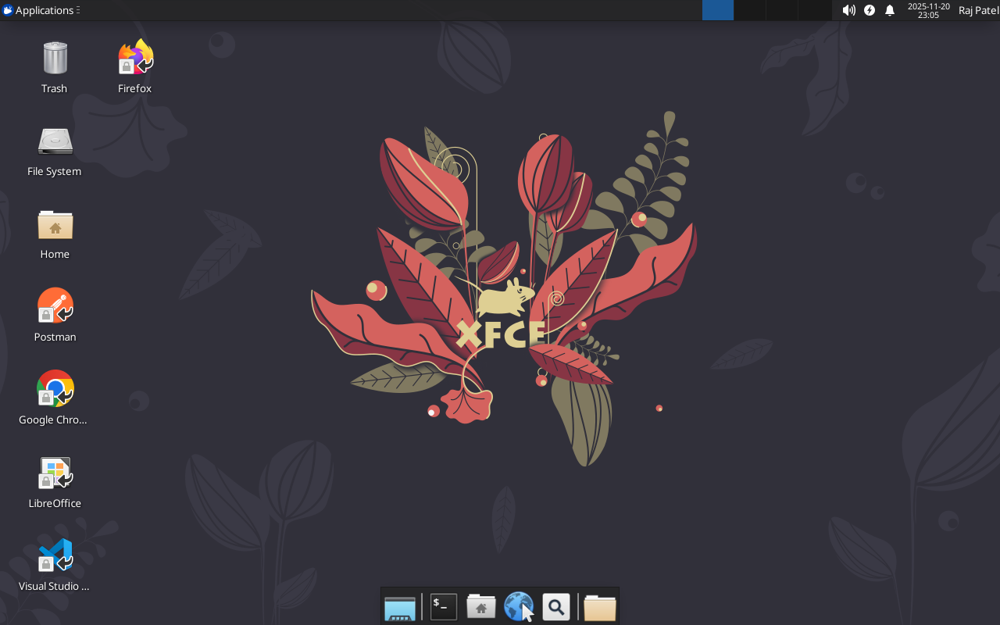
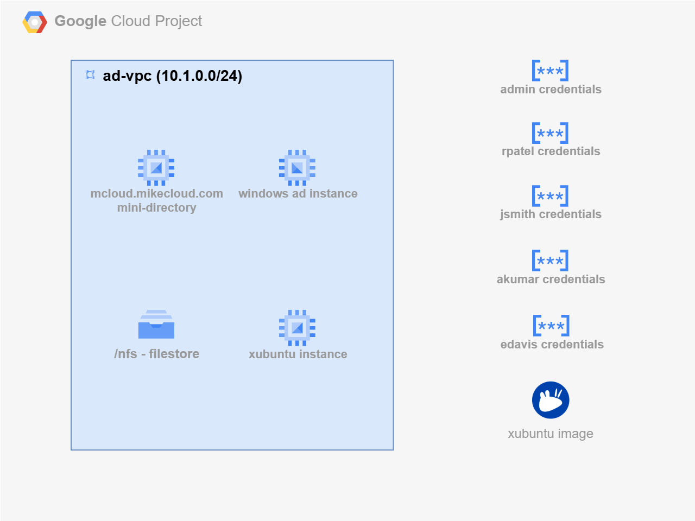
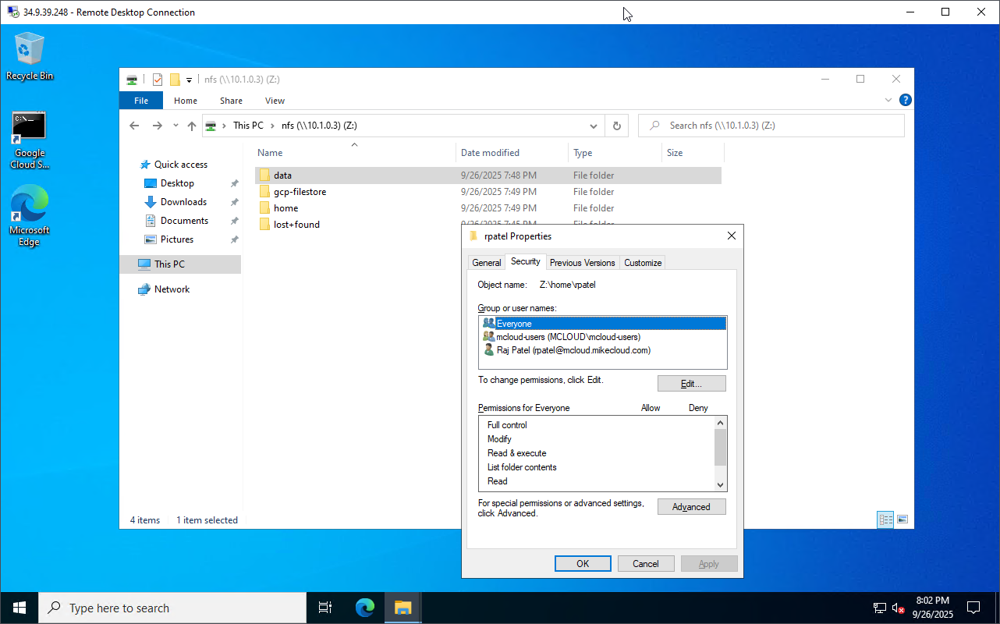
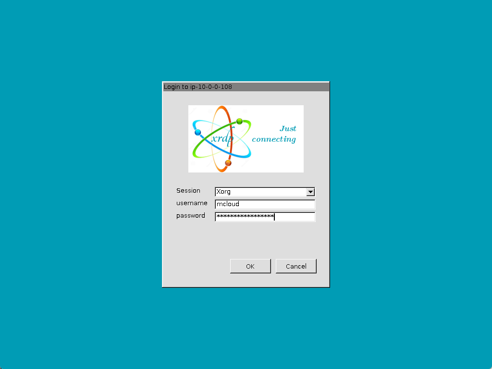

# Google Cloud Xubuntu XRDP Cloud Development Environment

This project provides a **complete cloud-based Linux desktop development environment**
powered by **Xubuntu + XRDP**, **Mini-Active Directory**, and **Google Filestore (NFS)**
on the **Google Cloud Platform (GCP)**.

It is designed as a **universal dev workstation** that contains the full superset of
tools, dependencies, and configurations used across all build projects on my channel.



Instead of manually configuring a workstation for each tutorial, demo, or cloud
project, this solution automatically provisions:

1. **A Custom Xubuntu XRDP GCP Image (Packer)**
   - Preloaded with Chrome, Firefox (deb), VS Code, Docker, KRDC, Postman
   - Includes all development tooling used across channel projects:
     **Packer, Terraform, Docker CLI, Azure CLI, AWS CLI v2, Google Cloud CLI**
   - Snap-free, clean, lightweight Xfce desktop
   - XRDP fully configured with all fixes, enhancements, and defaults
   - Desktop/panel icons, terminal emulator defaults, and `/etc/skel` customizations

2. **A Mini Active Directory Domain (Terraform)**
   - Samba-based AD Domain Controller running on GCP Compute Engine
   - Domain users generated from a template with friendly passwords
   - Central authentication for Linux and Windows clients

3. **Domain-Joined Xubuntu XRDP VM (Terraform)**
   - Deploys the Xubuntu XRDP instance using the Packer-built GCP custom image
   - Automatically joins the Mini-AD domain during boot
   - Ensures consistent user profiles and default settings through `/etc/skel`

4. **Google Filestore (NFS) for Persistent Home Directories**
   - Linux instances mount Filestore via NFS
   - Provides centralized, persistent, scalable home directories
   - Ideal for multi-VM desktop pools or GCP-based demo environments

The result is a **disposable, reproducible, cloud-hosted Linux workstation** that
can be used for **any build, automation, or cloud project**
featured on the channel.




## Prerequisites

* [A Google Cloud Account](https://console.cloud.google.com/)
* [Install gcloud CLI](https://cloud.google.com/sdk/docs/install) 
* [Install Terraform](https://developer.hashicorp.com/terraform/install)
* [Install Packer](https://developer.hashicorp.com/packer/install)

If this is your first time watching our content, we recommend starting with this video: [GCP + Terraform: Easy Setup](https://www.youtube.com/watch?v=6Pe_YkUeHEU). It provides a step-by-step guide to properly configure Terraform, Packer, and the gcloud CLI.

## Download this Repository  

Clone the repository from GitHub and move into the project directory:  

```bash
git clone https://github.com/mamonaco1973/gcp-xubuntu-xrdp.git
cd gcp-xubuntu-xrdp
```  

---

## Build the Code  

Run [check_env](check_env.sh) to validate your environment, then run [apply](apply.sh) to provision the infrastructure.  

```bash
develop-vm:~/gcp-xubuntu-xrdp$ ./apply.sh
NOTE: Validating that required commands are in PATH.
NOTE: gcloud is found in the current PATH.
NOTE: terraform is found in the current PATH.
NOTE: packer is found in the current PATH.
NOTE: All required commands are available.
NOTE: Checking Google Cloud CLI connection.
NOTE: Successfully authenticated with GCP.
Initializing provider plugins...
Terraform has been successfully initialized!
```  
## Build Results

When the deployment completes, the following resources are created:

- **Networking**
  - A **custom-mode VPC** with dedicated subnets for the Mini-AD domain controller,
    Filestore, and Xubuntu XRDP client VMs
  - **Firewall rules** allowing required AD/DC traffic (DNS 53, Kerberos 88,
    NTP 123, LDAP/SMB/RPC, dynamic RPC range) and **NFS (2049)** access to Filestore
    from trusted subnets
  - Internal DNS resolution provided by the **Samba AD DC**, with upstream
    forwarders configured as needed

- **Security & Identity**
  - **Secret Manager** entries for domain administrator and seeded user credentials
  - **Service accounts** and least-privilege IAM bindings for Compute Engine
  - Required **Google Cloud APIs enabled** (Compute Engine, Filestore,
    Secret Manager, Cloud DNS, etc.)

- **Active Directory Server**
  - An **Ubuntu** Compute Engine VM running **Samba 4** as an Active Directory
    Domain Controller and DNS server
  - Configured **Kerberos realm** and **NetBIOS** domain name
  - Administrator credentials securely stored in **Secret Manager**
  - **User and group bootstrap** driven by Terraform using:
    `01-directory/scripts/users.json.template`

- **Shared Storage (Google Filestore)**
  - A **Filestore instance** exporting an NFS share for user home directories
  - NFS endpoint reachable from domain-joined Linux clients
  - Mounted on Xubuntu XRDP instances (e.g., `/home`) with consistent POSIX
    ownership and permissions

- **Xubuntu XRDP Client**
  - A **custom-image Xubuntu VM** built with Packer and deployed via Terraform
  - **Automatically joined to the Mini-AD domain** at first boot
  - XRDP fully configured for domain authentication and multi-user access
  - User home directories backed by **Filestore NFS**, ensuring persistence
    across VM rebuilds

The result is a **fully domain-integrated, persistent, cloud-hosted Linux desktop**
environment on GCP, suitable for repeatable demos, development workflows,
and multi-user XRDP access.

## Users and Groups

As part of this project a set of **users** and **groups** are automatically created through a scripted process. These resources are intended for **testing and demonstration purposes**, showcasing how to automate user and group provisioning in a mini Active Directory environment.

### Groups Created

| Group Name    | Group Category | Group Scope | gidNumber |
|----------------|----------------|----------------|------------|
| mcloud-users   | Security       | Universal     | 10001 |
| india          | Security       | Universal     | 10002 |
| us             | Security       | Universal     | 10003 |
| linux-admins   | Security       | Universal     | 10004 |

### Users Created and Group Memberships

| Username | Full Name   | uidNumber | gidNumber | Groups Joined                    |
|---------|------------|-----------|-----------|----------------------|
| jsmith  | John Smith  | 10001 | 10001 | mcloud-users, us, linux-admins |
| edavis  | Emily Davis | 10002 | 10001 | mcloud-users, us |
| rpatel  | Raj Patel   | 10003 | 10001 | mcloud-users, india, linux-admins |
| akumar  | Amit Kumar  | 10004 | 10001 | mcloud-users, india |

---


### Understanding `uidNumber` and `gidNumber` for Linux Integration

The **`uidNumber`** (User ID) and **`gidNumber`** (Group ID) attributes are critical when integrating **Active Directory** with **Linux systems**, particularly in environments where **SSSD** ([System Security Services Daemon](https://sssd.io/)) or similar services are used for identity management. These attributes allow Linux hosts to recognize and map Active Directory users and groups into the **POSIX** (Portable Operating System Interface) user and group model.


### Creating a New Desktop User

Follow these steps to provision a new user in the Active Directory domain and validate their access to the Desktop.

1. **Connect to the Domain Controller**  
   - Log into the **`windows-ad-admin`** server via Remote Desktop (RDP).  
   - Use the `rpatel` or `jsmith` credentials that were provisioned during cluster deployment.  

2. **Launch Active Directory Users and Computers (ADUC)**  
   - From the Windows Start menu, open **“Active Directory Users and Computers.”**  
   - Enable **Advanced Features** under the **View** menu. This ensures you can access the extended attribute tabs (e.g., UID/GID mappings).  

3. **Navigate to the Users Organizational Unit (OU)**  
   - In the left-hand tree, expand the domain (e.g., `mcloud.mikecloud.com`).  
   - Select the **Users** OU where all cluster accounts are managed.  

4. **Create a New User Object**  
   - Right-click the Users OU and choose **New → User.**  
   - Provide the following:  
     - **Full Name:** Descriptive user name (e.g., “Mike Cloud”).  
     - **User Logon Name (User Principal Name / UPN):** e.g., `mcloud@mcloud.mikecloud.com`.  
     - **Initial Password:** Set an initial password.



5. **Assign a Unique UID Number**  
   - Open **PowerShell** on the AD server.  
   - Run the script located at:  
     ```powershell
     Z:\azure-xubuntu-xrdp\04-utils\getNextUID.bat
     ```  
   - This script returns the next available **`uidNumber`** to assign to the new account.  

6. **Configure Advanced Attributes**  
   - In the new user’s **Properties** dialog, open the **Attribute Editor** tab.  
   - Set the following values:  
     - `gidNumber` → **10001** (the shared GID for the `mcloud-users` group).  
     - `uid` → match the user’s AD login ID (e.g., `rpatel`).  
     - `uidNumber` → the unique numeric value returned from `getNextUID.ps1`.  

7. **Add Group Memberships**  
   - Go to the **Member Of** tab.  
   - Add the user to the following groups:  
     - **mcloud-users** → grants standard Desktop access.  
     - **us** (or other geographic/departmental group as applicable).  

8. **Validate User on Linux**  
   - Open an **AWS Systems Manager (SSM)** session to the **`xubuntu-instance`** instance.  
   - Run the following command to confirm the user’s identity mapping:  
     ```bash
     id mcloud
     ```  
   - Verify that the output shows the correct **UID**, **GID**, and group memberships (e.g., `mcloud-users`).  


9. **Validate Desktop Access**  
   - Open the a RDP session to the desktop environment
   - Log in with the new AD credentials.  



### Clean Up Infrastructure  

When you are finished testing, you can remove all provisioned resources with:  

```bash
./destroy.sh
```

This uses Terraform to delete the VPC, Compute Engine instances, firewall rules, Secret Manager entries, and any other resources created by this project.  

